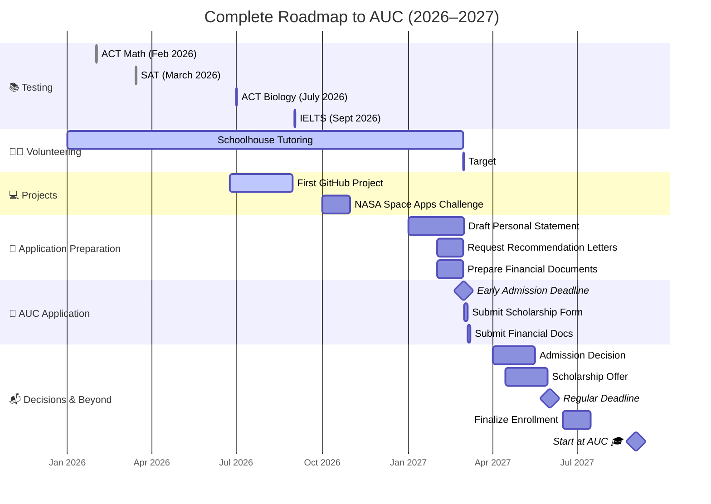

# 👋 Hi, I'm Omar Elmaghraby

**Aspiring Mechatronics Engineer • Future AUC Student • Robotics Enthusiast • Big Tech • USA Masters Pathway**

I'm a Grade 12 student based in Saudi Arabia, studying in a Cognia-accredited American curriculum school. I'm passionate about building systems that integrate software, electronics, and mechanical design — with a long‑term goal of working at top tech companies like **Google, Microsoft, Tesla, or Meta**, and pursuing a master's degree in the **USA**.

---

## 🎯 My Academic & Career Pathway

- **Fall 2027:** Apply to **The American University in Cairo (AUC)**  
  *Bachelor of Science in Mechatronics Engineering*  
  *Interests: Embedded Systems • Robotics • Automation • Systems Design*

- **During University:**  
  Gain hands-on experience through projects, research, internships, and competitive programming — aiming for opportunities at top tech companies

- **After Graduation:**  
  Pursue a **master's degree in the USA** in a field like Mechatronics, Robotics, AI, or Embedded Systems

- **Long‑Term Vision:**  
  Work as a mechatronics or systems engineer at **Google, Microsoft, Tesla, or Meta** — contributing to impactful technology and innovative hardware-software solutions

---

## 🛠️ Technologies I'm Learning

**Languages:** Python, C++, JavaScript 

**Tools:** Git, GitHub, VS Code

**Interests:** Robotics, embedded systems, control systems, automation, AI/ML, systems design

---

## 🚀 Projects & Portfolio

*I recently joined GitHub and I'm currently brainstorming and planning my first mechatronics and software projects. Stay tuned!*

| Project | Description | Status |
| :--- | :--- | :--- |
| **GitHub Portfolio Setup** | Setting up my developer profile, learning Git workflows, and planning my first repositories | ✅ Active |
| **First Mechatronics Project** | Exploring ideas that combine microcontrollers (Arduino/Raspberry Pi) with Python/C++ | ⏳ Planned |
| **Algorithm Practice** | Solving problems to improve my C++ and Python logic for future technical interviews | ⏳ Planned |

---

## 🌟 Achievements & Involvement

- **4.0 GPA** (Grade 12, American Diploma)
- **SAT:** 1530 (780 Math, 750 EBRW) - SuperScoring 
- **NASA Space Apps Challenge 2026** — Selected participant
- **Cognia-Accredited School** — Egyptian equivalency path secured for AUC

---

## 📈 Goals for 2026–2027

- ✅ Maintain 4.0 GPA
- ✅ Achieve 1500+ SAT
- ⏳ Complete 100+ volunteer hours (Schoolhouse)
- ⏳ Build and publish my first open-source project on GitHub
- ⏳ Take IELTS/TOEFL for English proficiency
- ⏳ Apply to AUC by **March 1, 2027** (early admission)
- ⏳ Secure strong scholarship (target: 100% tuition)
- ⏳ Build a portfolio that strengthens my path toward **Big Tech + USA master's**

#### 📅 My Complete Roadmap to AUC (2026–2027)

## 📫 Connect With Me

**GitHub:** ``Eng-OmarElmaghraby``
---
🚀 Thanks for visiting my profile! I'm building a future in mechatronics, Big Tech, and beyond — one project at a time.
